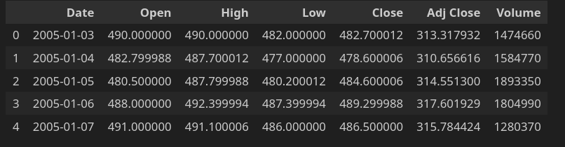
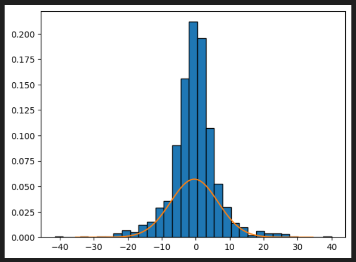
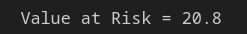
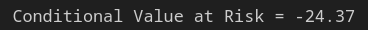
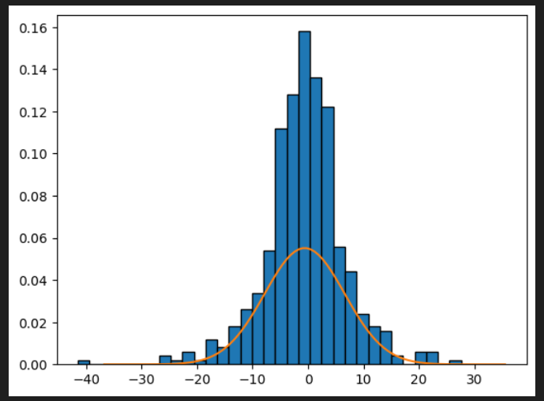
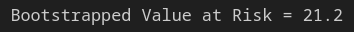
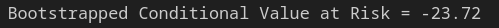

# Value at Risk (VaR) - Conditional Value at Risk (CVaR) - Bootstrapping

This notebook shows how to compute the VaR and the CVaR on P/L data.

### Load the data and compute the daily P/L.

The data consists in only one asset, and the daily P/L data is compute as the difference
from 2 successive close prices.

### Plot the P/L distribution

### Compute the VaR and the CVaR

### Bootstrapped VaR & CVaR

Another to estimate the VaR and CVaR is to compute them on a sample of the original P/L data.

Here the samples distribution:

And the sample VaR and CVaR:

